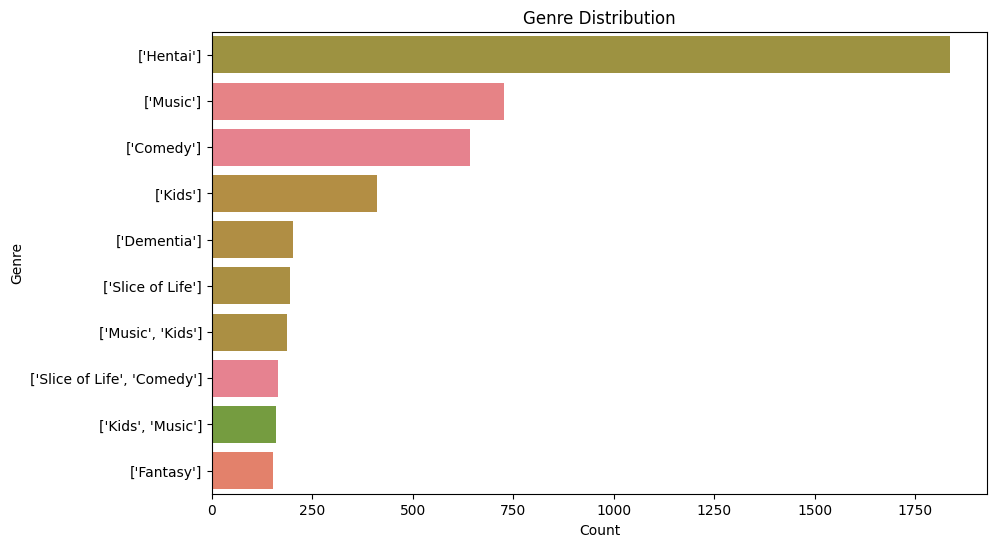
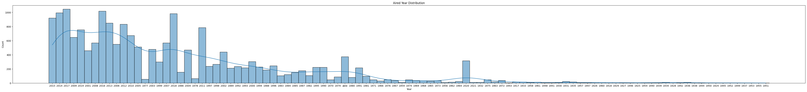
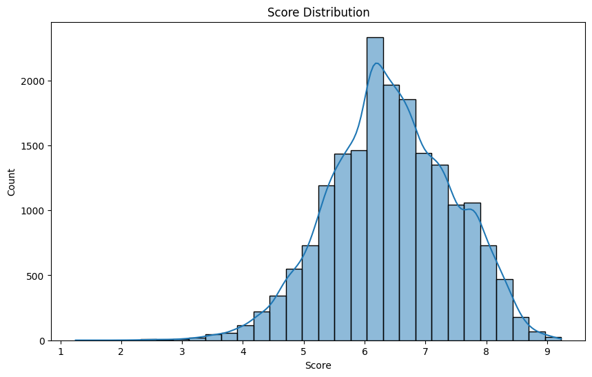
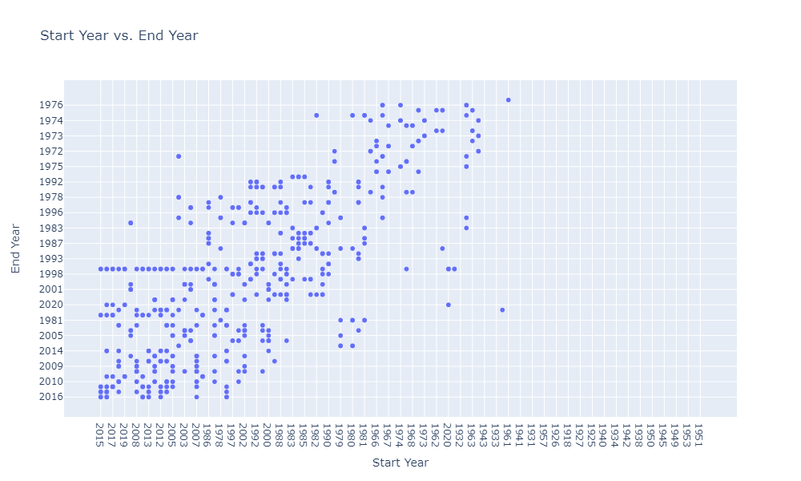
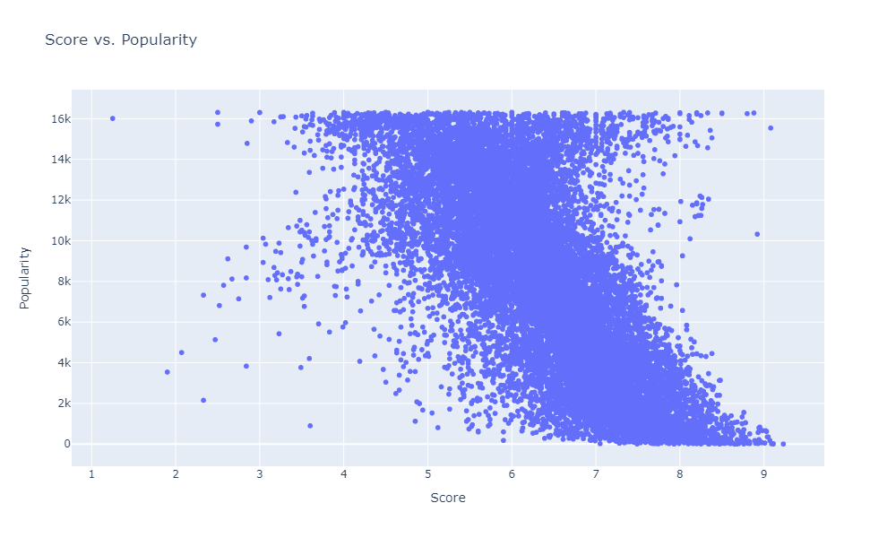
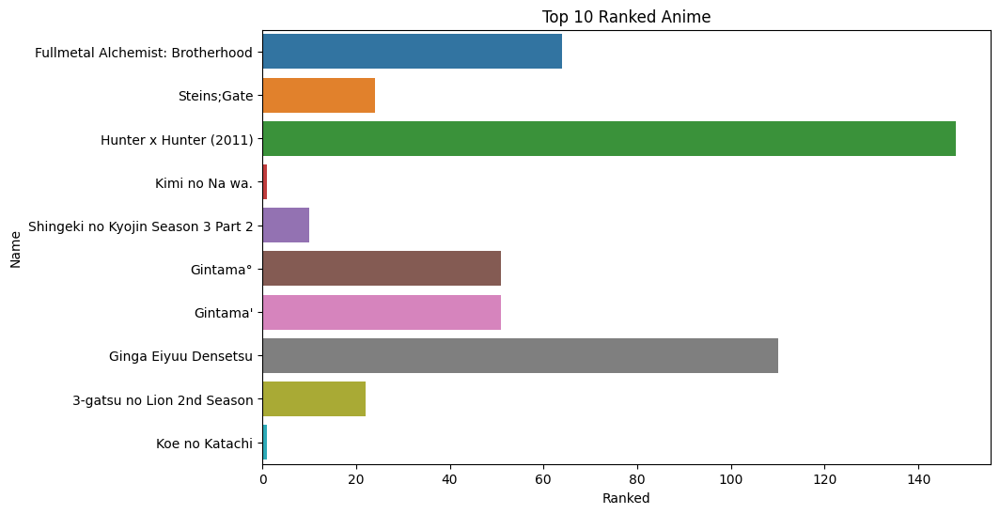
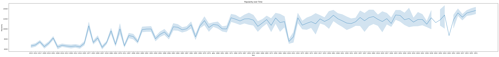
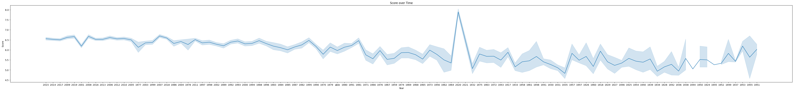
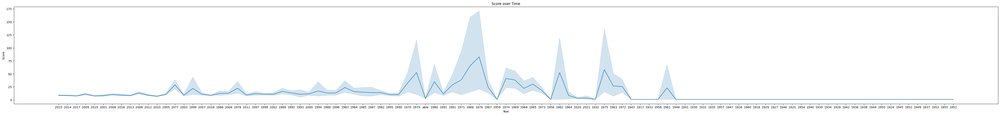

# Animes Data Analysis

-----

## Problem Statement

**Problem Statement:**

The anime industry experiences continual growth and evolution, with a vast array of series being produced each year. However, understanding the dynamics of this industry and identifying trends in anime production, popularity, and reception can be challenging due to the sheer volume of data available. As such, there is a need for comprehensive analysis tools to extract **meaningful insights** from anime datasets.

This project aims to address this need by conducting a thorough analysis of an anime dataset. By leveraging **data visualization** techniques, we seek to uncover **trends, patterns, and relationships** within the data that provide **valuable insights** into various aspects of the anime industry. These insights can help stakeholders such as producers, distributors, and viewers make **informed decisions** about content creation, marketing strategies, and consumption preferences.

The key objectives of this project include:
1. Analyzing the distribution of **genres** to understand audience preferences and genre **popularity**.
2. Examining the **production trends** over time to identify periods of **growth, stagnation, or decline** in the anime industry.
3. Investigating the relationship between **episode lengths** and audience engagement to optimize **storytelling formats**.
4. Exploring the correlation between **audience size, popularity, and critical acclaim** to understand factors driving anime **success**.
5. Tracking changes in audience perceptions of **quality** over time to identify shifts in **preferences** and **standards**.

By addressing these objectives, this project aims to provide stakeholders in the anime industry with **actionable insights** that can inform **decision-making processes** and contribute to the continued growth and success of the industry.

-----

## Identify the Data

[Dataset](https://github.com/Tanay-Dwivedi/Animes-Data-Analysis/blob/master/animes.csv)

Identifying the data involves recognizing the dataset's **structure**, **variables**, and their **meanings**. It also entails understanding the **context** and **source** of the data to ensure its **relevance** and **reliability** for analysis.

The dataset I've chosen provides **comprehensive details** about each anime, such as its **title**, **synopsis**, **genre**, and important **performance metrics** like **episodes**, **popularity**, and **score**. This data allows for **in-depth analysis** of trends in anime **content**, **popularity**, and **quality** over time. By examining **relationships** between various variables, the dataset offers insights crucial for **decision-making** in aspects like **content creation** and **marketing strategies** within the anime industry.

-----

## Results & Inference

### Genre Distribution:

**Aim**: The aim is to understand the diversity of anime genres present in the dataset and to identify any dominant or niche genres.

**Observation**: This analysis provides insights into the prevalence of different genres within the anime dataset. It identifies the most common genres and their relative frequencies.

### Aired Year Distribution:

**Aim**: The aim is to track the growth and evolution of the anime industry over time, identifying key periods of expansion or decline.

**Observation**: The distribution of anime across years shows the production trend over time. It reveals periods of high or low anime production.

### Episodes Distribution:

**Aim**: The aim is to understand the typical episode lengths in anime and identify any trends or patterns in storytelling formats.

**Observation**: This analysis illustrates the distribution of the number of episodes in anime series. It indicates whether most anime have few or many episodes.

### Members vs. Popularity:

**Aim**: The aim is to explore the relationship between audience engagement (measured by the number of members) and overall popularity of anime.

**Observation**: It examines whether anime with a larger number of members tend to be more popular, indicating any correlation between audience size and popularity.

### Score Distribution:

**Aim**: The aim is to understand the overall quality perception of anime in the dataset and identify any patterns or trends in scoring.

**Observation**: This analysis showcases the distribution of scores given to anime, revealing whether most anime are rated highly, poorly, or fall in between.

### Top 10 Ranked Anime:

**Aim**: The aim is to identify the most acclaimed and highly ranked anime in the dataset, providing recommendations for viewers interested in top-quality content.

**Observation**: It highlights the top-ranked anime in the dataset, showcasing the most highly regarded titles based on ranking.

### Popularity over Time:

**Aim**: The aim is to understand the dynamics of audience engagement with anime over time, identifying periods of increased or decreased popularity.

**Observation**: This analysis tracks how the popularity of anime has changed over the years, indicating any trends or fluctuations in audience interest.

### Score over Time:
 
**Aim**: The aim is to analyze trends in the perceived quality of anime over time, identifying any shifts in audience tastes or standards.

**Observation**: It shows how the average score of anime has evolved over the years, indicating changes in audience preferences or quality of content.

### Episodes over Time:

**Aim**: The aim is to understand the evolution of episode lengths in anime over time, identifying any shifts towards shorter or longer series and exploring factors driving these changes, such as audience preferences or industry trends. Additionally, it helps in predicting future trends in episode lengths and planning anime production accordingly.

**Observation**: This analysis tracks how the average number of episodes in anime has changed over the years. It reveals any trends or patterns in the episode lengths of anime series.

-----

## Conclusion

In conclusion, the analysis of the anime dataset has yielded **valuable insights** into genre preferences, production trends, episode lengths, audience engagement, and quality perceptions. These findings empower stakeholders to make **informed decisions** regarding content creation, marketing strategies, and audience targeting.

## Recommendations

1. **Diversify Genres**: Expand genre offerings to appeal to a wider audience.
2. **Strategic Production**: Plan releases based on production trends to avoid oversaturation.
3. **Optimize Episode Lengths**: Tailor episode lengths to enhance viewer engagement.
4. **Engage Audience**: Interact with fans through social media and events to build a strong community.
5. **Maintain Quality**: Invest in talent and production values to ensure high-quality content.

-----